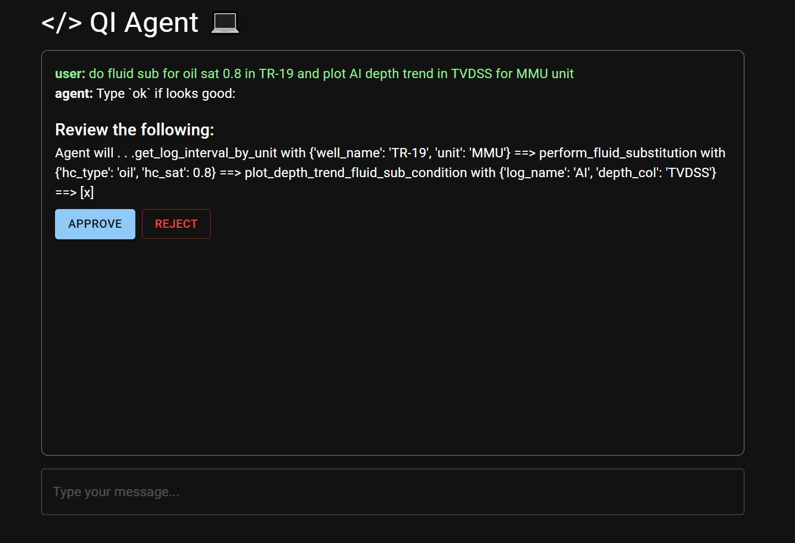
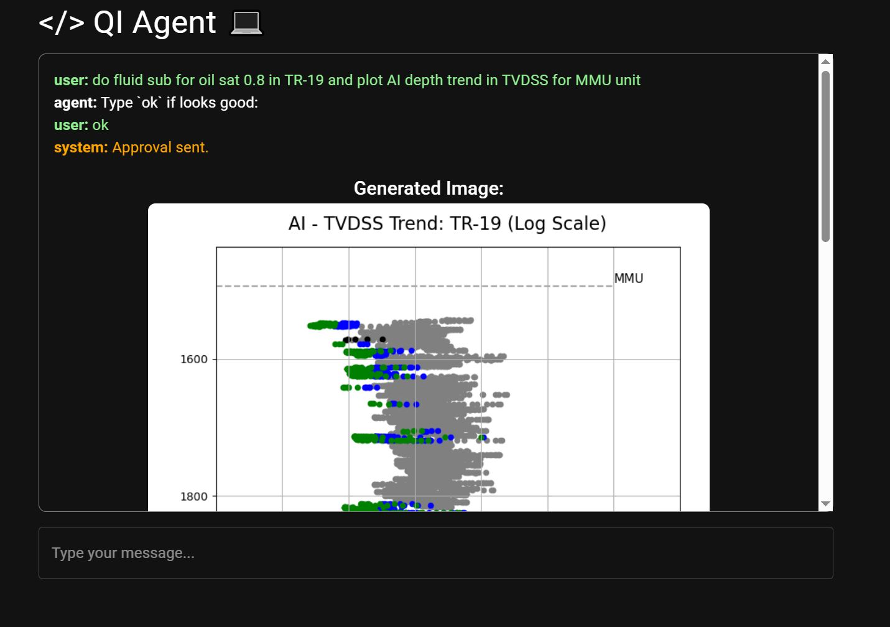

# Quantitative Interpretation with LLM Chat Interface

<!--  -->
<!--  -->


## Features

### Quantitative Interpretation Logic

- **Data Visualization**
- **Fluid substitution**
- **Quantify Hydrocarbon Separation**

### LLM Chat Interface via Tool Calling

- **TBC**

### Web UI


## Repository Structure

```plaintext
├── agent/                          #
│   ├── agents.py                   # Agent class
│   ├── graph.py                    # Execution graph
│   ├── ollama_models.py            # locally hosted model
│   ├── gpt_models.py               # GPT-4o via AzureOpenAI
│   ├── prompts.py                  # Pre-filled system prompts
├── qi/                             #
│   ├──qi_lang.py                   # Helper functions
│   ├──qi_tools.py                  # Business Logic
│   ├──qi_well.py                   # Class wrapper for well (.las)
├── tools/                          #
│   ├──tool_exec.py                 # Tool Exection after LLMs' output
├── webui/                          #
│   ├── main.py                     #
│   ├── index.html                  #
├── data_server.py                  # 
└── README.md                       # Project documentation (this file)
```

### Test Coverage

- **TBC**
